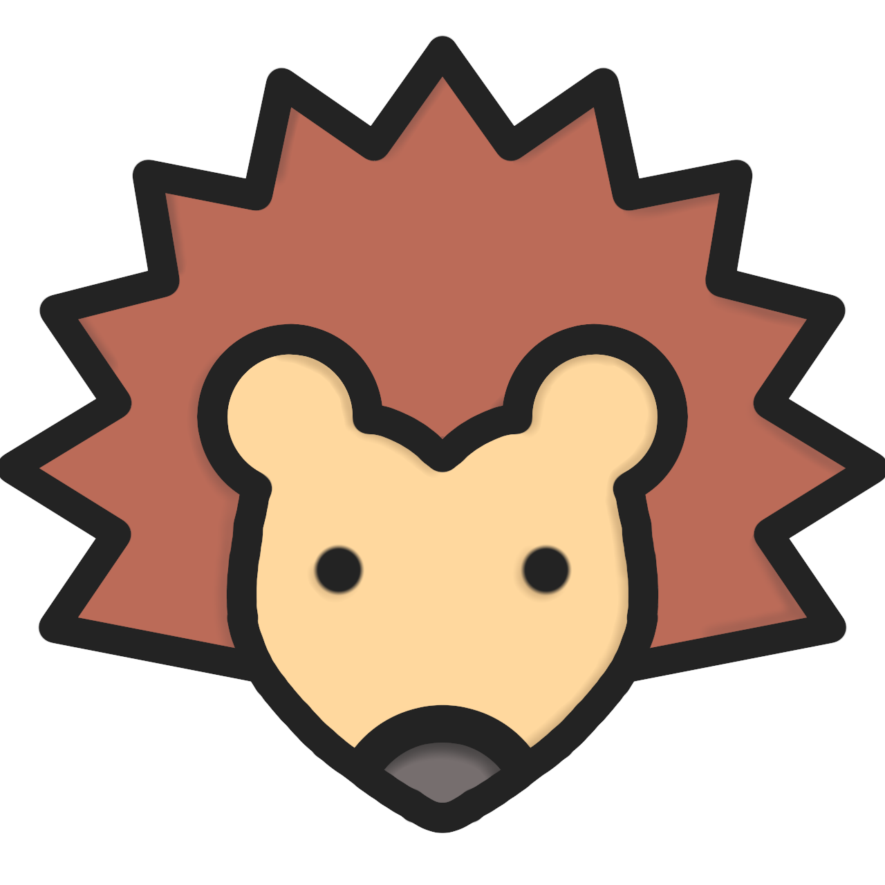

  

<h1 align="center">Hedgehog bot</h1>

### Тамагочи чат-бот для Вконтакте с элементами MMORPG для любителей ёжиков.

* Заведи собственного ёжика
* Корми его и отправляй на работу 
* Получай опыт и прокачивай ежа  
* Создавай семью и заводи ежат
* Участвуй в праздничных ивентах

<h2 align="center">баг-трекер:</h1>

Нашли баг? Сообщите о нём в [поддержку](https://vk.me/myhedgehog_bot_sup) описав следующее:
* Заголовок:
* Шаги воспроизведения:
* Фактический результат:
* Ожидаемый результат:
* Тип проблемы
  * Неработающая функциональность
  * Потеря прогресса
  * Ошибка в тексте 

**В зависимости от приоритета проблемы вы получите соответствующее вознаграждение.** 

<h2 align="center">ВНИМАНИЕ:</h2>
<h3>Чат-бот находится в разработке, многие функции могут работать нестабильно, а некоторые и вовсе не работать.</h3>

***

Copyright © 2023 [fiersik ](https://github.com/fiersik).

